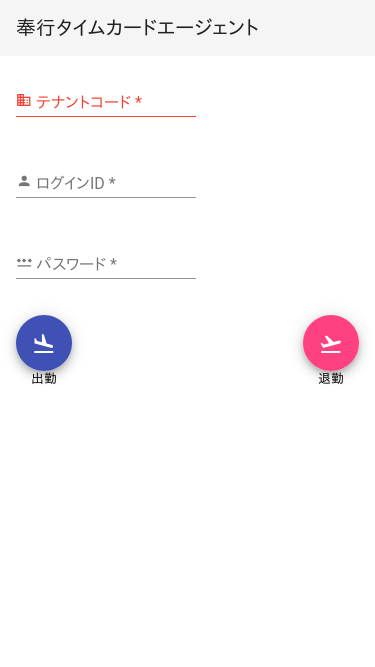

# 奉行クラウドタイムカードエージェント Web フロントエンド Angular

出勤と退勤に特化した、打刻専用モバイル向け UI です。



#

## Running dev server

```bash
npm run start
```

## Testing

```bash
npm run test
```

## Deploying to azure blob storage

Azure サブスクリプション ID を設定

```bash
npm config set azure.subscription 'AzureサブスクリプションID'
```

ファイルのコピー先を設定

```bash
npm config set azcopy.dest 'http://your.blob.windows.net/$web'
```

```bash
npm run azcopy
```
